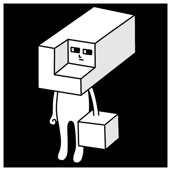
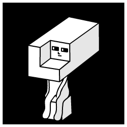

## ME

**放送作家**です。専門は冗談です。イラストを描くのとアニメを作るのはとても難しいです。**冗談計算機**の研究と開発をしています。

## SKILLS 

    
    
    

## REPOS

[**【日記】冗談計算機**](https://github.com/idutsu/kirikuchikun-diary)  
冗談計算機を研究開発していて思ったことや感じたことを書いています

[**【研究】冗談計算機**](https://github.com/idutsu/kirikuchikun-res)  
冗談計算機の研究過程を書いています

[**【開発】冗談計算機**](https://github.com/idutsu/kirikuchikun-dev)  
冗談計算機のソースコードを書いています

## CONTACT

お問い合わせは email@idutsu.com までご連絡ください。

## GALLERY

